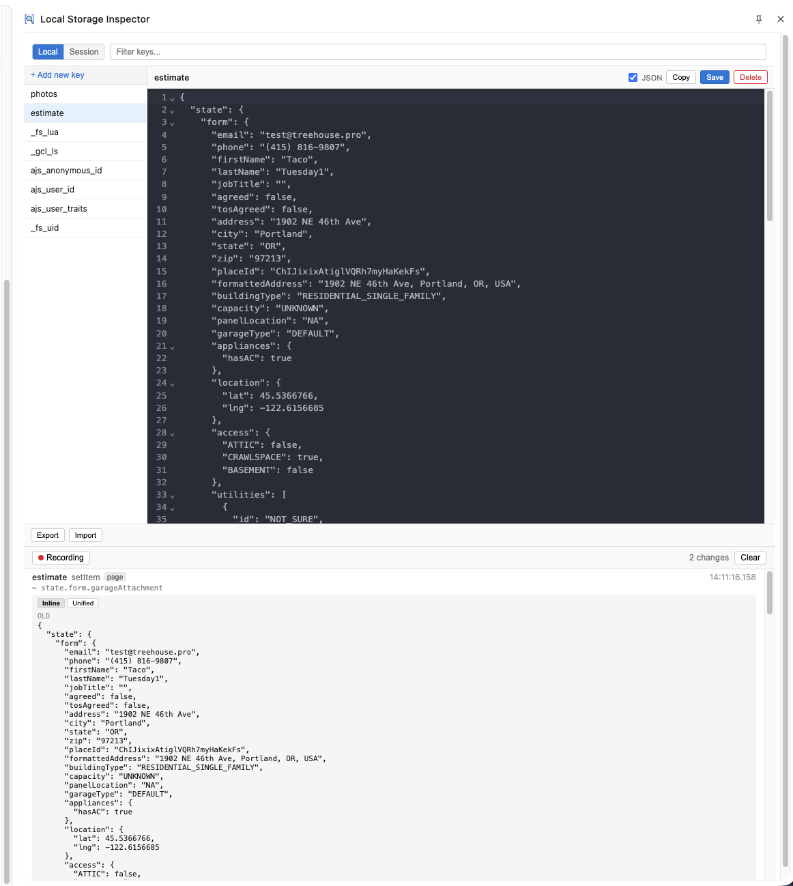

<p align="center">
  
</p>

<h1 align="center">Local Storage Inspector</h1>

<p align="center">
  A Chrome extension for viewing and editing localStorage and sessionStorage with a proper JSON editor.
</p>

<p align="center">
  <a href="https://github.com/pete-the-pete/local-storage-inspector/actions/workflows/ci.yml"></a>
  <a href="LICENSE"></a>
  
</p>

---



## Features

- **Browse storage** -- View all localStorage and sessionStorage keys in a searchable side panel
- **JSON editor** -- Edit values with CodeMirror 6, including syntax highlighting (One Dark theme) and validation
- **Change monitoring** -- Real-time log of storage mutations with field-level diff highlighting
- **Inline/Unified diff** -- Toggle between stacked and unified diff views for JSON changes
- **Import/Export** -- Bulk import and export storage entries as JSON
- **Resizable panels** -- Drag to resize the keys list and history sections; collapse the keys panel when you need more room

## Installation

### From source

```bash
# Clone the repo
git clone https://github.com/pete-the-pete/local-storage-inspector.git
cd local-storage-inspector

# Install dependencies
bun install

# Build the extension
bun run build
```

Then load in Chrome:

1. Open `chrome://extensions`
2. Enable **Developer mode** (top right)
3. Click **Load unpacked** and select the `dist/` folder
4. Click the extension icon on any page to open the side panel

## Usage

1. Navigate to any website
2. Click the Local Storage Inspector icon in the toolbar
3. The side panel opens showing all storage keys for the current page
4. Click a key to view/edit its value
5. Toggle between **Local** and **Session** storage
6. Use the search bar to filter keys
7. The **Recording** section at the bottom shows real-time storage changes with diffs

## Development

```bash
bun run dev          # Vite dev server with HMR
bun run build        # TypeScript check + Vite production build
bun run test         # Vitest unit tests
bun run test:e2e     # Playwright E2E tests (headed, Chrome required)
bun run lint         # ESLint
bun run format       # Prettier
```

### Tech stack

- **Runtime**: [Bun](https://bun.sh) (package manager + script runner)
- **Language**: TypeScript (strict mode)
- **UI**: React 19 + CSS Modules
- **Editor**: CodeMirror 6
- **Build**: Vite + [@crxjs/vite-plugin](https://crxjs.dev/vite-plugin)
- **Testing**: Vitest (unit) + Playwright (E2E)
- **Linting**: ESLint + Prettier

### Project structure

```
src/
  lib/           Pure functions (parse, validate, filter, diff, storage helpers)
  shared/        TypeScript types shared between sidepanel and content script
  sidepanel/     React components (side panel UI)
  content/       Content script (relays storage change events)
  background/    Service worker (opens side panel on icon click)
public/
  icons/         Extension icons (SVG source + PNG exports)
  storage-interceptor.js   MAIN world script that captures storage mutations
tests/
  unit/          Vitest unit tests
  e2e/           Playwright E2E tests
```

## Contributing

See [CONTRIBUTING.md](CONTRIBUTING.md) for development workflow, code style, and PR guidelines.

## License

[MIT](LICENSE)
